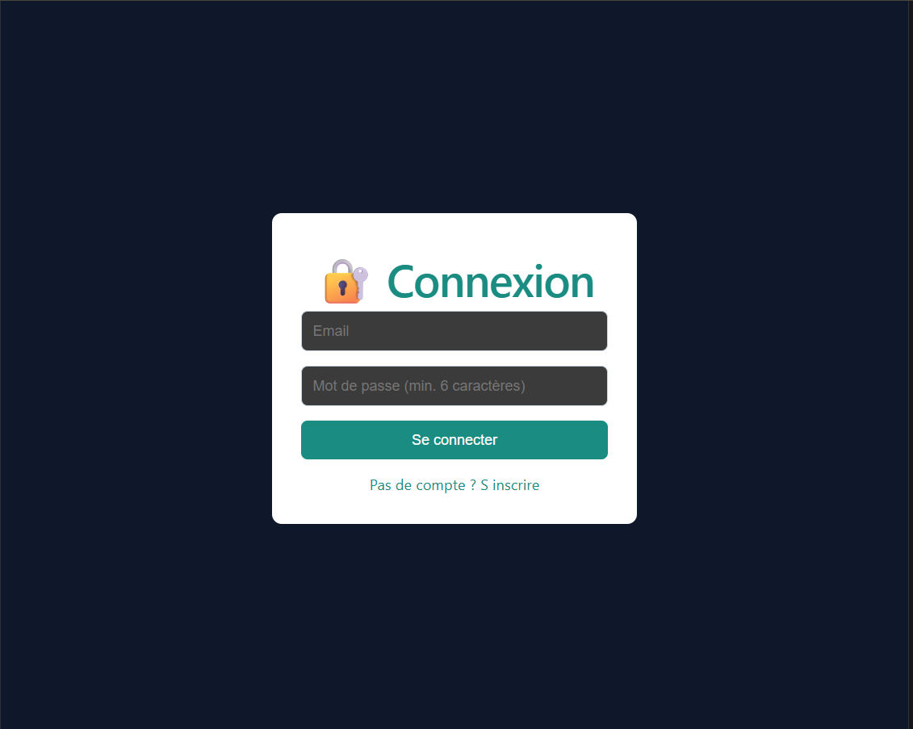
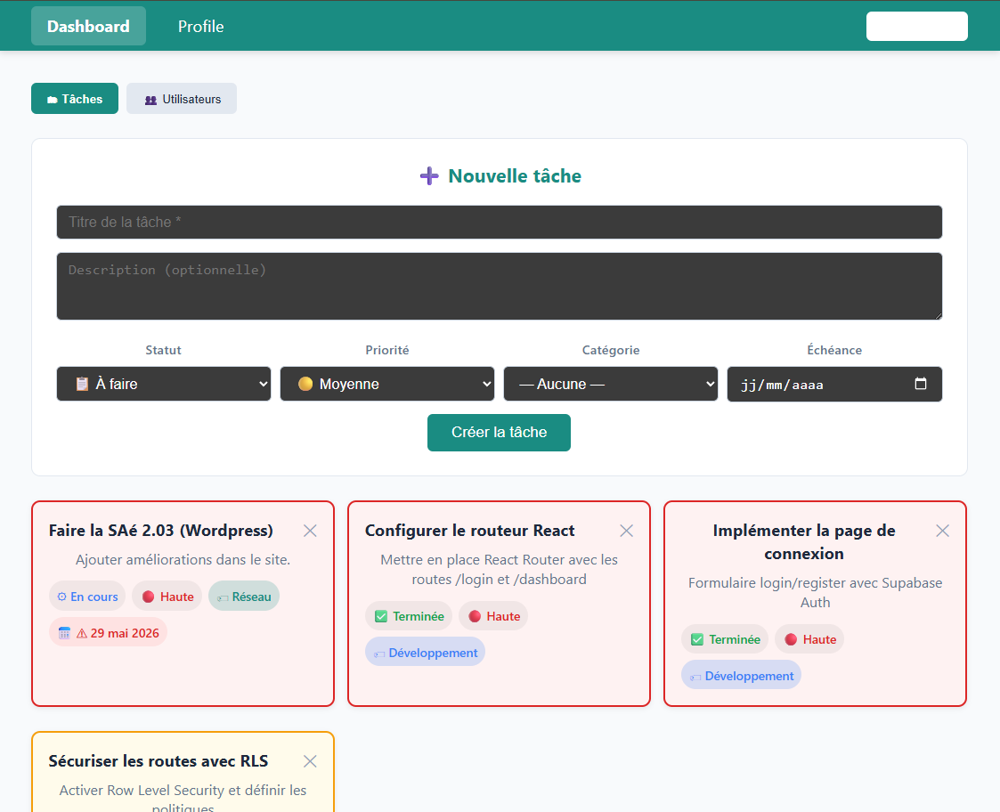

# KanbanRT

Application web de gestion de tâches Kanban full-stack, développée dans le cadre du module R2.09.

## 👥 Équipe
* Yanis LAÏD
* Herehauarii ISMAEL
* Khadim DIAGNE

## 🚀 Liens du projet
* **Application en production :** https://mon-kanban-beta.vercel.app
* **Dépôt GitHub :** https://github.com/Yanis1717/mon-kanban.git

## 🛠️ Stack Technique
* **Frontend :** React, Vite, React Router
* **Backend & Base de données :** Supabase (PostgreSQL, Auth, Storage)
* **Déploiement & CI/CD :** Vercel
* **Mails :** API Route Vercel (Serverless) + Resend

## 💻 Instructions d'installation locale

Pour lancer ce projet sur votre machine, exécutez les commandes suivantes :

1. Cloner le dépôt : `git clone https://github.com/Yanis1717/mon-kanban.git`
2. Entrer dans le répertoire du projet : `cd mon-kanban`
3. Installer les dépendances : `npm install`
4. Configurer l'environnement : Créer un fichier `.env.local` à la racine et y insérer les variables `VITE_SUPABASE_URL`, `VITE_SUPABASE_ANON_KEY` et `RESEND_API_KEY`.
5. Lancer le serveur de développement : `npm run dev`

## 📸 Aperçu de l'application

### Page de Connexion

### Dashboard
